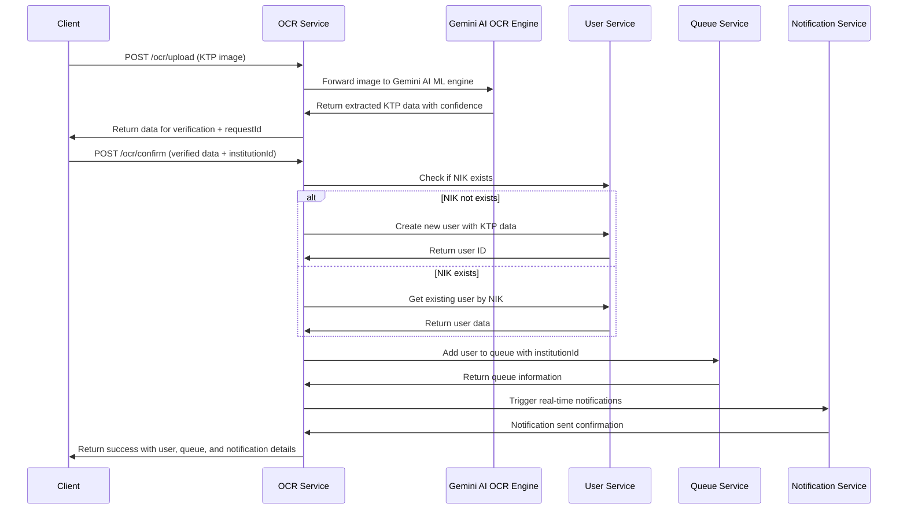

# MediQ OCR Service v3.0

Mikroservice untuk pemrosesan OCR (Optical Character Recognition) dokumen KTP dalam sistem MediQ. Service ini mengintegrasikan dengan Gemini AI OCR Engine dan otomatis mendaftarkan pengguna ke antrian dengan real-time notifications.

## 🚀 Features

- **Gemini AI OCR Integration** - Powered by Google Gemini AI for superior KTP data extraction
- **KTP Upload & Processing** - Upload gambar KTP untuk ekstraksi data dengan akurasi tinggi
- **Data Verification** - Verifikasi dan edit data hasil OCR dengan intelligent suggestions
- **Auto User Registration** - Otomatis buat user dengan data KTP lengkap dan validasi NIK
- **Enhanced Queue Management** - Advanced queue integration dengan priority handling
- **Real-time Notifications** - Trigger notifikasi real-time untuk status updates
- **Institution Support** - Dukung pendaftaran dengan ID institusi dan workflow validation
- **Microservice Communication** - Integrasi dengan User Service, Queue Service, dan OCR Engine
- **Improved Workflow** - End-to-end automation dengan error handling dan retry mechanism

## 🔌 API Endpoints

### OCR Processing
- `POST /ocr/upload` - Upload gambar KTP untuk proses OCR dengan Gemini AI
- `POST /ocr/confirm` - Konfirmasi data OCR dan daftarkan ke antrian dengan notifikasi
- `GET /ocr/status/:requestId` - Get status pemrosesan OCR request
- `POST /ocr/retry/:requestId` - Retry pemrosesan OCR yang gagal

### Health & Monitoring
- `GET /health` - Health check endpoint untuk monitoring
- `GET /metrics` - Performance metrics dan statistics

### Swagger Documentation
- **Local**: `http://localhost:8603/api/docs`
- **Production**: `https://mediq-ocr-service.craftthingy.com/api/docs`
- **API Version**: v3.0 with Gemini AI integration documentation

## 📝 API Usage

### 1. Upload KTP Image
```http
POST /ocr/upload
Content-Type: multipart/form-data

{
  "file": KTP_IMAGE_FILE
}
```

**Response:**
```json
{
  "success": true,
  "message": "KTP scanned successfully with Gemini AI. Please verify and edit the data.",
  "requestId": "ocr-req-12345-abc",
  "data": {
    "nik": "3171012345678901",
    "nama": "JOHN DOE SMITH",
    "tempat_lahir": "JAKARTA",
    "tgl_lahir": "15-08-1990",
    "jenis_kelamin": "LAKI-LAKI",
    "alamat": {
      "name": "JL. MENTENG RAYA NO. 123",
      "kel_desa": "KELURAHAN MENTENG",
      "kecamatan": "MENTENG",
      "rt_rw": "001/002"
    },
    "agama": "ISLAM",
    "status_perkawinan": "BELUM KAWIN",
    "pekerjaan": "KARYAWAN SWASTA",
    "kewarganegaraan": "WNI",
    "berlaku_hingga": "SEUMUR HIDUP"
  },
  "confidence": 0.95,
  "processingTime": "1.2s",
  "aiEngine": "gemini-pro-vision"
}
```

### 2. Confirm OCR Data & Queue Registration
```http
POST /ocr/confirm
Content-Type: application/json

{
  "data": {
    "nik": "3171012345678901",
    "nama": "JOHN DOE SMITH",
    // ... verified KTP data
  },
  "institutionId": "inst-uuid-1234-5678" // Optional
}
```

**Response:**
```json
{
  "success": true,
  "message": "Data berhasil diproses dan masuk ke antrian dengan notifikasi real-time.",
  "user": {
    "id": "user-uuid-1234",
    "nik": "3171012345678901",
    "name": "JOHN DOE SMITH",
    "isNewUser": true
  },
  "queue": {
    "id": "PQ-20240120-001",
    "userId": "user-uuid-1234",
    "institutionId": "inst-uuid-1234-5678",
    "status": "waiting",
    "queueNumber": 1,
    "estimatedWaitTime": "15 minutes",
    "priority": "normal"
  },
  "notifications": {
    "sent": true,
    "channels": ["websocket", "sms"],
    "notificationId": "notif-uuid-5678"
  }
}
```

## 🔄 Data Flow

### Complete OCR to Queue Flow with Gemini AI & Real-time Notifications


## 🏗️ Architecture

### Service Dependencies
- **OCR Engine Service** (Port 8604) - Gemini AI ML processing untuk ekstraksi data KTP
- **User Service** (Port 8602) - User management dan data storage
- **Queue Service** (Port 8605) - Enhanced queue management untuk antrian faskes
- **Notification Service** - Real-time notification triggers dan delivery

### Message Patterns (RabbitMQ)

#### Outgoing Messages
```typescript
// To User Service
'user.check-nik-exists' -> { nik: string }
'user.create' -> CreateUserDto (dengan KTP data lengkap)
'user.get-by-nik' -> { nik: string }
'user.update-profile' -> { userId: string, data: Partial<UserDto> }

// To Queue Service  
'queue.add-to-queue' -> { userId: string, institutionId?: string, priority?: string }
'queue.get-status' -> { queueId: string }
'queue.update-priority' -> { queueId: string, priority: string }

// To Notification Service
'notification.trigger' -> { 
  userId: string, 
  type: 'queue_registered' | 'ocr_completed', 
  data: any,
  channels: ['websocket', 'sms', 'email']
}
'notification.send-bulk' -> { userIds: string[], message: string }
```

## 🔧 Environment Variables

```env
PORT=8603
RABBITMQ_URL="amqp://localhost:5672"
OCR_API_URL="http://localhost:8604"
GEMINI_API_KEY="your-gemini-api-key"
GEMINI_MODEL="gemini-pro-vision"
REDIS_URL="redis://localhost:6379"
NOTIFICATION_SERVICE_URL="http://localhost:8607"
NODE_ENV="development"
LOG_LEVEL="info"
MAX_FILE_SIZE="10MB"
SUPPORTED_FORMATS="jpg,jpeg,png,pdf"
OCR_TIMEOUT="30000"
RETRY_ATTEMPTS=3
CONFIDENCE_THRESHOLD=0.8
```

## 📊 Data Mapping & Integration

### Gemini AI OCR Engine Integration
```typescript
// Gemini AI OCR Response Format
interface GeminiOCRResponse {
  nik: string;
  nama: string;
  tempat_lahir: string;
  tgl_lahir: string;
  alamat: {
    name: string;
    kel_desa: string;
    kecamatan: string;
    rt_rw: string;
  };
  confidence: number; // 0-1
  processingTime: string;
  aiEngine: 'gemini-pro-vision';
  suggestions?: string[]; // AI suggestions for data verification
}
```

### OCR Engine → User Service Data Mapping
```typescript
// Gemini OCR Engine format
{
  nik: string,
  nama: string,
  tempat_lahir: string,
  tgl_lahir: string,
  alamat: {
    name: string,
    kel_desa: string,
    kecamatan: string,
    rt_rw: string
  },
  confidence: number,
  suggestions: string[]
}

// Mapped to User Service format
{
  nik: data.nik,
  name: data.nama,
  tempat_lahir: data.tempat_lahir,
  tgl_lahir: data.tgl_lahir,
  alamat_jalan: data.alamat?.name,
  alamat_kel_desa: data.alamat?.kel_desa,
  alamat_kecamatan: data.alamat?.kecamatan,
  alamat_rt_rw: data.alamat?.rt_rw,
  ocr_confidence: data.confidence,
  data_source: 'gemini-ai-ocr'
}
```

## 🏃‍♂️ Development

```bash
# Install dependencies
npm install

# Start development server
npm run start:dev

# Build for production
npm run build

# Run tests
npm run test
npm run test:e2e

# Run linting
npm run lint
```

## 🧪 Testing

### Manual Testing with curl
```bash
# Upload KTP image
curl -X POST \
  http://localhost:8603/ocr/upload \
  -H "Content-Type: multipart/form-data" \
  -F "file=@path/to/ktp-image.jpg"

# Confirm OCR data
curl -X POST \
  http://localhost:8603/ocr/confirm \
  -H "Content-Type: application/json" \
  -d '{
    "data": {
      "nik": "3171012345678901",
      "nama": "JOHN DOE SMITH",
      "tempat_lahir": "JAKARTA"
    },
    "institutionId": "inst-123"
  }'
```

## 🛡️ Security & Validation

- **File Upload Validation** - Validasi tipe dan ukuran file gambar
- **Data Validation** - Class-validator untuk OCR data
- **NIK Validation** - Format dan uniqueness check
- **Error Handling** - Comprehensive error handling dengan proper HTTP status codes

## 📈 Monitoring

- Health check endpoint untuk monitoring
- Logging untuk debugging dan audit trail
- Error tracking dan performance monitoring
- RabbitMQ connection monitoring

## 🔄 Integration dengan Services Lain

### API Gateway
- Semua endpoints exposed melalui API Gateway
- Authentication dan authorization handling
- Rate limiting dan circuit breaker

### Institution Service
- Mendukung pendaftaran dengan institution ID
- Validasi institution exists sebelum queue registration
- Workflow validation untuk enhanced processing

### Real-time Notification Integration
- WebSocket connections untuk instant updates
- SMS/Email notifications via external providers
- Multi-channel notification delivery
- Notification status tracking dan retry logic

## 🏥 Use Cases

### 1. Walk-in Patient Registration with Gemini AI
1. Pasien datang ke faskes
2. Operator scan KTP pasien dengan improved accuracy
3. Gemini AI ekstrak data KTP dengan confidence scoring
4. Operator verifikasi data dengan AI suggestions
5. Pasien otomatis masuk antrian dengan real-time notification
6. WebSocket notification ke mobile app pasien

### 2. Online Pre-registration with Enhanced Workflow
1. Pasien upload KTP via mobile app
2. Gemini AI proses OCR di background dengan retry logic
3. Pasien verifikasi data via app dengan intelligent suggestions
4. Pilih faskes untuk pendaftaran dengan availability check
5. Masuk antrian online dengan priority handling
6. Multi-channel notifications (SMS, email, push) untuk status updates

### 3. Bulk Registration Processing
1. Healthcare facility uploads multiple KTP images
2. Batch processing dengan Gemini AI untuk mass OCR
3. Automated user creation dengan duplicate detection
4. Bulk queue registration dengan priority assignment
5. Real-time progress tracking dan bulk notifications

---

**Version:** 3.0  
**Port:** 8603  
**Public URL:** https://mediq-ocr-service.craftthingy.com  
**Queue:** ocr_service_queue  
**Dependencies:** Gemini AI OCR Engine (8604), User Service (8602), Enhanced Queue Service (8605), Notification Service (8607)  
**AI Engine:** Google Gemini Pro Vision  
**Real-time Features:** WebSocket notifications, Multi-channel messaging, Priority queue management
