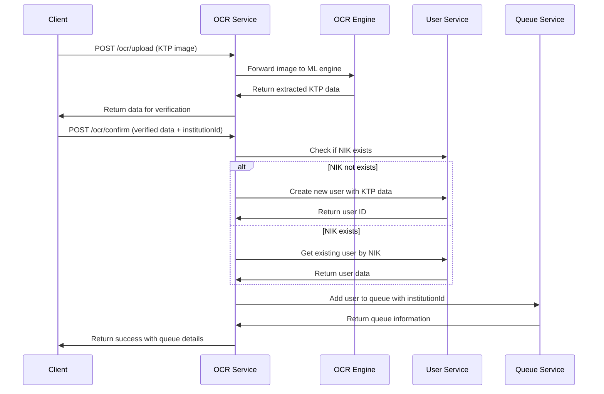

# MediQ OCR Service

Mikroservice untuk pemrosesan OCR (Optical Character Recognition) dokumen KTP dalam sistem MediQ. Service ini mengintegrasikan dengan OCR Engine Service dan otomatis mendaftarkan pengguna ke antrian setelah konfirmasi data.

## 🚀 Features

- **KTP Upload & Processing** - Upload gambar KTP untuk ekstraksi data
- **Data Verification** - Verifikasi dan edit data hasil OCR
- **Auto User Registration** - Otomatis buat user dengan data KTP lengkap
- **Queue Integration** - Langsung daftarkan ke antrian faskes
- **Institution Support** - Dukung pendaftaran dengan ID institusi
- **Microservice Communication** - Integrasi dengan User Service dan Queue Service

## 🔌 API Endpoints

### OCR Processing
- `POST /ocr/upload` - Upload gambar KTP untuk proses OCR
- `POST /ocr/confirm` - Konfirmasi data OCR dan daftarkan ke antrian

### Swagger Documentation
Dokumentasi API tersedia di: `http://localhost:8603/api/docs`

## 📝 API Usage

### 1. Upload KTP Image
```http
POST /ocr/upload
Content-Type: multipart/form-data

{
  "file": KTP_IMAGE_FILE
}
```

**Response:**
```json
{
  "success": true,
  "message": "KTP scanned successfully. Please verify and edit the data.",
  "data": {
    "nik": "3171012345678901",
    "nama": "JOHN DOE SMITH",
    "tempat_lahir": "JAKARTA",
    "tgl_lahir": "15-08-1990",
    "jenis_kelamin": "LAKI-LAKI",
    "alamat": {
      "name": "JL. MENTENG RAYA NO. 123",
      "kel_desa": "KELURAHAN MENTENG",
      "kecamatan": "MENTENG",
      "rt_rw": "001/002"
    },
    "agama": "ISLAM",
    "status_perkawinan": "BELUM KAWIN",
    "pekerjaan": "KARYAWAN SWASTA",
    "kewarganegaraan": "WNI",
    "berlaku_hingga": "SEUMUR HIDUP"
  }
}
```

### 2. Confirm OCR Data & Queue Registration
```http
POST /ocr/confirm
Content-Type: application/json

{
  "data": {
    "nik": "3171012345678901",
    "nama": "JOHN DOE SMITH",
    // ... verified KTP data
  },
  "institutionId": "inst-uuid-1234-5678" // Optional
}
```

**Response:**
```json
{
  "success": true,
  "message": "Data berhasil diproses dan masuk ke antrian.",
  "queue": {
    "id": "PQ-20240120-001",
    "userId": "user-uuid-1234",
    "institutionId": "inst-uuid-1234-5678",
    "status": "waiting",
    "queueNumber": 1,
    "estimatedWaitTime": "15 minutes"
  }
}
```

## 🔄 Data Flow

### Complete OCR to Queue Flow


## 🏗️ Architecture

### Service Dependencies
- **OCR Engine Service** (Port 8604) - ML processing untuk ekstraksi data KTP
- **User Service** (Port 8602) - User management dan data storage
- **Queue Service** (Port 8605) - Queue management untuk antrian faskes

### Message Patterns (RabbitMQ)

#### Outgoing Messages
```typescript
// To User Service
'user.check-nik-exists' -> { nik: string }
'user.create' -> CreateUserDto (dengan KTP data lengkap)
'user.get-by-nik' -> { nik: string }

// To Queue Service  
'queue.add-to-queue' -> { userId: string, institutionId?: string }
```

## 🔧 Environment Variables

```env
PORT=8603
RABBITMQ_URL="amqp://localhost:5672"
OCR_API_URL="http://localhost:8604"
NODE_ENV="development"
```

## 📊 Data Mapping

### OCR Engine → User Service Data Mapping
```typescript
// OCR Engine format
{
  nik: string,
  nama: string,
  tempat_lahir: string,
  tgl_lahir: string,
  alamat: {
    name: string,
    kel_desa: string,
    kecamatan: string,
    rt_rw: string
  },
  // ... other fields
}

// Mapped to User Service format
{
  nik: data.nik,
  name: data.nama,
  tempat_lahir: data.tempat_lahir,
  tgl_lahir: data.tgl_lahir,
  alamat_jalan: data.alamat?.name,
  alamat_kel_desa: data.alamat?.kel_desa,
  alamat_kecamatan: data.alamat?.kecamatan,
  alamat_rt_rw: data.alamat?.rt_rw,
  // ... other mapped fields
}
```

## 🏃‍♂️ Development

```bash
# Install dependencies
npm install

# Start development server
npm run start:dev

# Build for production
npm run build

# Run tests
npm run test
npm run test:e2e

# Run linting
npm run lint
```

## 🧪 Testing

### Manual Testing with curl
```bash
# Upload KTP image
curl -X POST \
  http://localhost:8603/ocr/upload \
  -H "Content-Type: multipart/form-data" \
  -F "file=@path/to/ktp-image.jpg"

# Confirm OCR data
curl -X POST \
  http://localhost:8603/ocr/confirm \
  -H "Content-Type: application/json" \
  -d '{
    "data": {
      "nik": "3171012345678901",
      "nama": "JOHN DOE SMITH",
      "tempat_lahir": "JAKARTA"
    },
    "institutionId": "inst-123"
  }'
```

## 🛡️ Security & Validation

- **File Upload Validation** - Validasi tipe dan ukuran file gambar
- **Data Validation** - Class-validator untuk OCR data
- **NIK Validation** - Format dan uniqueness check
- **Error Handling** - Comprehensive error handling dengan proper HTTP status codes

## 📈 Monitoring

- Health check endpoint untuk monitoring
- Logging untuk debugging dan audit trail
- Error tracking dan performance monitoring
- RabbitMQ connection monitoring

## 🔄 Integration dengan Services Lain

### API Gateway
- Semua endpoints exposed melalui API Gateway
- Authentication dan authorization handling
- Rate limiting dan circuit breaker

### Institution Service
- Mendukung pendaftaran dengan institution ID
- Validasi institution exists sebelum queue registration

## 🏥 Use Cases

### 1. Walk-in Patient Registration
1. Pasien datang ke faskes
2. Operator scan KTP pasien
3. Sistem ekstrak data KTP
4. Operator verifikasi data
5. Pasien otomatis masuk antrian

### 2. Online Pre-registration
1. Pasien upload KTP via mobile app
2. Sistem proses OCR di background
3. Pasien verifikasi data via app
4. Pilih faskes untuk pendaftaran
5. Masuk antrian online

---

**Port:** 8603  
**Public URL:** https://mediq-ocr-service.craftthingy.com  
**Queue:** ocr_service_queue  
**Dependencies:** OCR Engine (8604), User Service (8602), Queue Service (8605)
